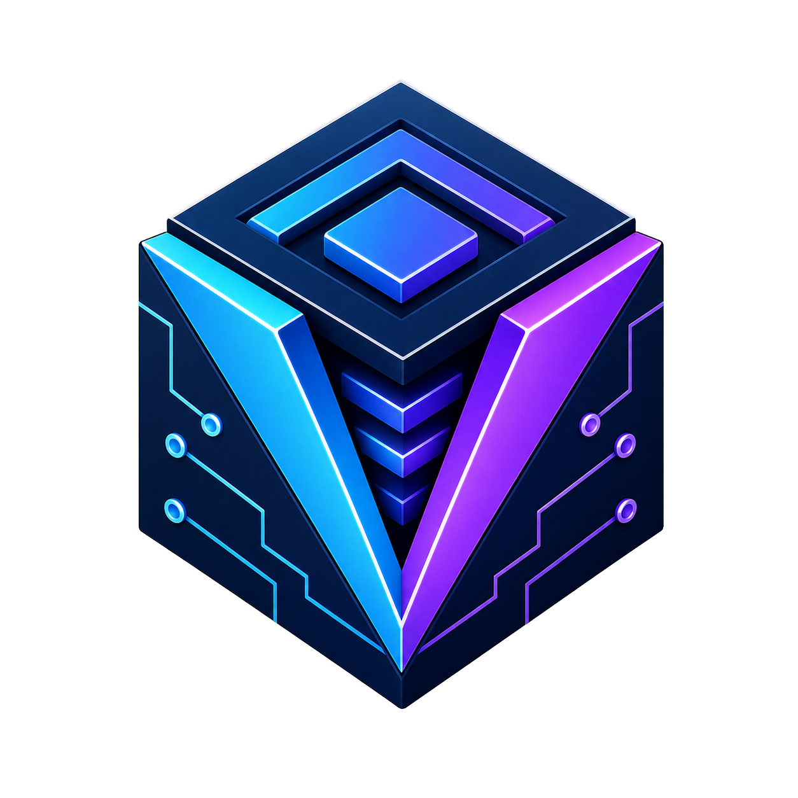
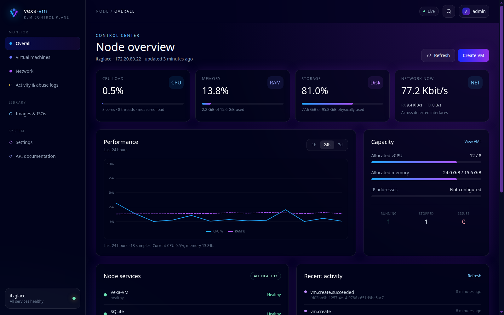
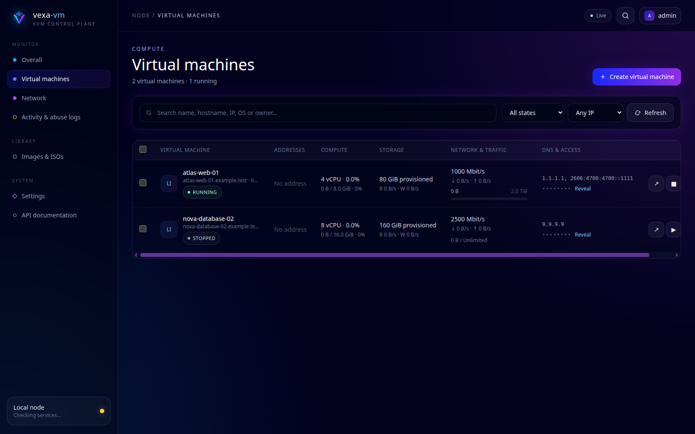
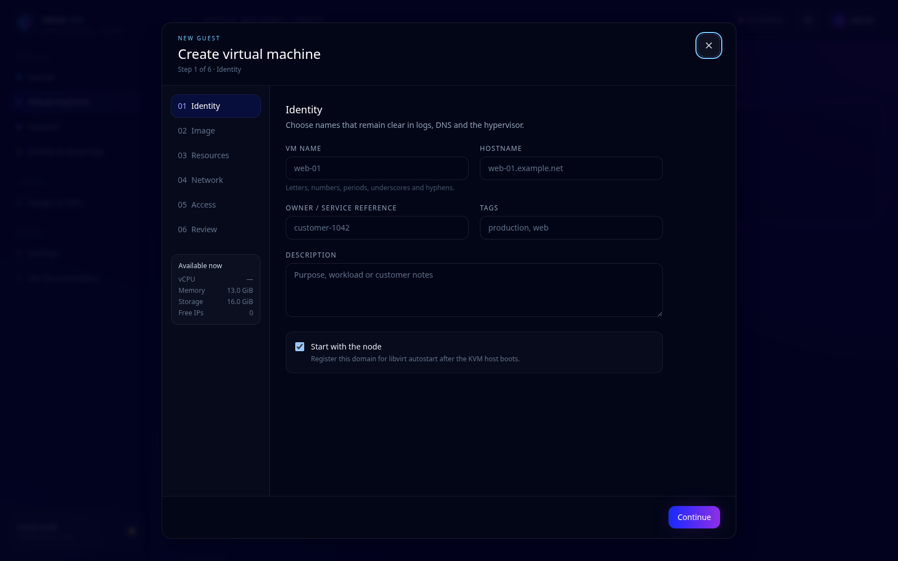
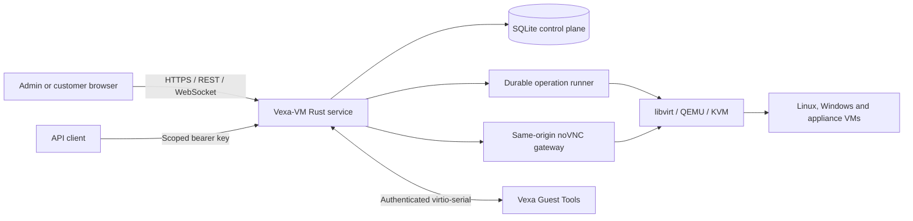

<p align="center">
  
</p>

<h1 align="center">Vexa-VM</h1>

<p align="center">
  A free, open-source KVM virtualization control panel and API written in Rust.
</p>

<p align="center">
  <a href="https://github.com/ItzGlace/vaxa-vm/actions/workflows/ci.yml"></a>
  <a href="https://github.com/ItzGlace/vaxa-vm/releases"></a>
  <a href="LICENSE"></a>
  <a href="https://www.rust-lang.org/"></a>
  
</p>

Vexa-VM turns a Linux KVM/libvirt host into a modern virtual-machine platform. One Rust service
provides the web panel, versioned REST API, customer self-service portal, noVNC console gateway,
dual-stack address inventory, traffic accounting, VM firewall controls, image library, jobs, metrics,
and audit trail.

It is designed for operators who want a self-hosted, open-source alternative to closed VM
management panels without assembling a separate frontend, API, job runner, and console proxy.
Version `0.1.1` manages one KVM node. It is not yet a drop-in replacement for multi-node clustering,
live migration, or distributed storage in Proxmox VE, VMware vSphere, or OpenStack.



## Why Vexa-VM

- **Complete VM lifecycle:** create, start, stop, reboot, hard reboot, pause, resume, suspend,
  reinstall, resize, snapshot, protect, and delete guests through the panel or API.
- **Automatic and manual provisioning:** cloud images, ISO installers, cloud-init, UEFI/BIOS,
  qcow2 storage, Linux and Windows workflows, and opt-in Vexa Guest Tools.
- **Built-in customer portal:** revocable scoped status links expose only one VM, with power,
  reinstall, DNS, credential, SSH-key, firewall, traffic, and console actions controlled by scope.
- **Secure browser console:** one-time noVNC links become same-origin cookie sessions and expire
  after exactly ten minutes; the QEMU VNC target remains loopback-only.
- **IPv4 and IPv6 inventory:** pools, numeric address ordering, main/reserved/free/used state,
  reverse DNS metadata, VM ownership, default DNS, routed networking, and bridge support.
- **Network guardrails:** default-on TAP-to-IP ownership for managed pools, per-VM rate and traffic
  quotas, automatic network isolation when a finite quota is exceeded, customer-controlled port
  rules, optional DDoS profiles, and optional full hypervisor-only BCP38 filtering.
- **Real observability:** host and guest CPU, RAM, disk, network, quota, and service health; 1-hour,
  24-hour, and 7-day charts; durable operations; activity logs; and IP abuse evidence records.
- **Security by design:** Argon2id admin passwords, AES-256-GCM guest secrets, hashed bearer tokens,
  CSRF protection, scoped API keys, role-based administrators, restrictive systemd units, and
  security-sensitive `no-store` responses.
- **Authenticated Guest Tools:** Rust agents for Linux and Windows use a VM-bound virtio-serial
  channel for password, DNS, hostname, SSH-key, and network configuration without depending on a
  general-purpose guest agent.
- **Operator-friendly releases:** immutable version directories, atomic activation, online SQLite
  backup, readiness checks, rollback, checksums, and optional Ed25519-signed in-panel updates.

## Screenshots

| Virtual-machine inventory | Guided creation workflow |
| --- | --- |
| [](docs/screenshots/virtual-machines.png) | [](docs/screenshots/create-virtual-machine.png) |

These images come from the real application running its safe mock backend with documentation-only
guest records. They contain no production node or customer data.

## Install

### One-line installer

Review [`install.sh`](install.sh), then run it on a fresh Debian/Ubuntu or RHEL-compatible KVM host:

```bash
curl -fsSL https://raw.githubusercontent.com/ItzGlace/vaxa-vm/main/install.sh | sudo bash
```

The installer verifies the release checksum, detects virtualization and host capacity, installs KVM
dependencies, creates the restricted `vexa` service account, and prints a generated first-run admin
password exactly once.

### Debian package

Download `vexa-vm_0.1.1_amd64.deb` from the matching GitHub release, then:

```bash
sudo apt install ./vexa-vm_0.1.1_amd64.deb
```

### APT repository

The release workflow can publish a signed Debian repository to GitHub Pages. After the repository
owner configures its dedicated APT signing key, installation becomes:

```bash
curl -fsSL https://itzglace.github.io/vaxa-vm/vexa-vm-archive-keyring.gpg \
  | sudo tee /usr/share/keyrings/vexa-vm-archive-keyring.gpg >/dev/null
echo "deb [arch=amd64 signed-by=/usr/share/keyrings/vexa-vm-archive-keyring.gpg] https://itzglace.github.io/vaxa-vm stable main" \
  | sudo tee /etc/apt/sources.list.d/vexa-vm.list
sudo apt update
sudo apt install vexa-vm
```

See [Debian and APT packaging](docs/DEBIAN-APT.md) before advertising the repository as live.

## Host requirements

- Linux x86_64 with Intel VT-x or AMD-V enabled and `/dev/kvm` available.
- KVM/QEMU, libvirt, `virsh`, `virt-install`, `qemu-img`, cloud-image-utils, iproute2, and nftables.
- A dedicated VM storage path with sufficient free space.
- A reviewed bridge or routed-TAP network design and out-of-band access before changing host routes.
- A TLS reverse proxy for every internet-accessible installation.

Vexa-VM reports missing capabilities; it does not silently rewrite the physical host network. Start
with [Installation and operations](docs/INSTALL.md) and [Network security](docs/NETWORK-SECURITY.md).

## Architecture



The service uses Axum, Tokio, rusqlite, Tera, Tailwind CSS, and a capability-oriented hypervisor
interface with mock and libvirt implementations. See [Architecture](docs/ARCHITECTURE.md).

## Panel and API

| Route | Purpose |
| --- | --- |
| `/overall` | Host facts, capability checks, health, capacity, live metrics and history |
| `/vms` | VM inventory, metrics, secrets, networking, lifecycle and customer links |
| `/vms/create` | Six-step creation workflow for automatic or manual images |
| `/network` | IPv4/IPv6 pools, addresses, DNS, speed, quota and protection defaults |
| `/isos` | Verified ISO/cloud-image catalog and provisioning capabilities |
| `/logs` | Activity audit and IP abuse evidence records |
| `/settings` | Node, storage, network, console, security, administrators, API keys and updates |
| `/status/{token}` | Scoped customer self-service session |
| `/vnc/{token}` | One-time ten-minute noVNC console session |
| `/docs` | Built-in API documentation |
| `/api/v1/*` | Versioned administrator and API-key interface |

The machine-readable specification is in [`docs/openapi.json`](docs/openapi.json). API keys are
shown once, stored as digests, assigned explicit scopes, and may be limited to source IP ranges.

## Build from source

```bash
npm ci
npm run build
npm test
cargo test --locked --all-targets
cargo build --locked --release --bins
```

For a local mock-backend run:

```bash
export VEXA_MASTER_KEY="$(openssl rand -base64 32)"
export VEXA_BOOTSTRAP_PASSWORD="$(openssl rand -base64 24)"
export VEXA_PUBLIC_URL=http://127.0.0.1:8080
export VEXA_SECURE_COOKIES=false
cargo run
```

Do not use the mock backend as proof that a physical host is ready for provisioning. On a real node,
review the capability report on **Overall** and complete the storage/network preparation first.

## Documentation

- [Installation and operations](docs/INSTALL.md)
- [REST API](docs/API.md) and [OpenAPI document](docs/openapi.json)
- [Security model](docs/SECURITY.md)
- [Vexa Guest Tools](docs/GUEST-TOOLS.md)
- [Network and disk protection](docs/NETWORK-SECURITY.md)
- [Activity and audit records](docs/AUDIT.md)
- [Signed updates and rollback](docs/UPDATES.md)
- [Debian and APT packaging](docs/DEBIAN-APT.md)

## Community and roadmap

Read [CONTRIBUTING.md](CONTRIBUTING.md) before opening a pull request and report vulnerabilities
privately according to [SECURITY.md](SECURITY.md). Good first contributions include additional Linux
image profiles, localized documentation, more host capability probes, ARM64 packaging, and automated
upgrade/restore testing.

Near-term roadmap items include multi-node inventory, scheduled backups, storage-pool adapters,
cluster-aware placement, live migration, and high-availability orchestration. Roadmap entries are not
release commitments.

## License

Vexa-VM is free software licensed under the GNU Affero General Public License v3.0 or later. Network
users must be offered the corresponding source for modified deployments. See [LICENSE](LICENSE).
